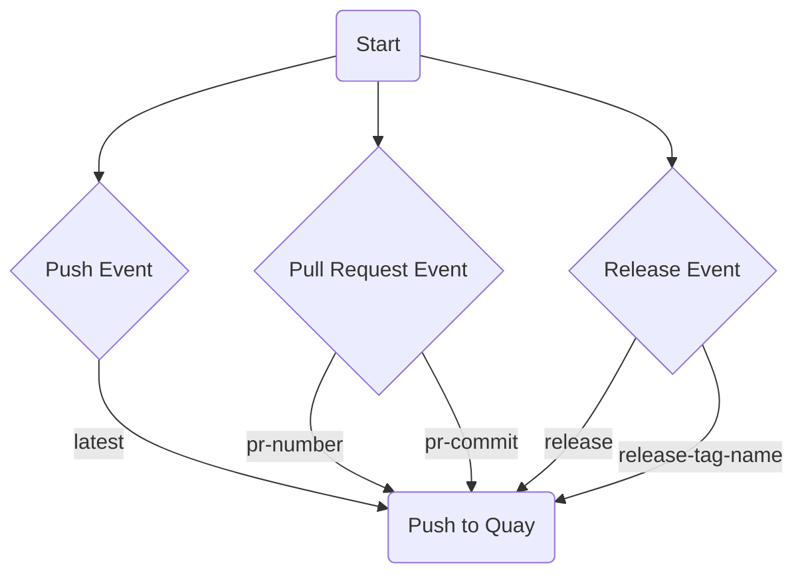

# Open Security Issue Management (OSIM)

Incident Response Web UI

## Recommended IDE Setup

[VSCode](https://code.visualstudio.com/) + [Volar](https://marketplace.visualstudio.com/items?itemName=Vue.volar) (and disable Vetur) + [TypeScript Vue Plugin (Volar)](https://marketplace.visualstudio.com/items?itemName=Vue.vscode-typescript-vue-plugin).

## Type Support for `.vue` Imports in TS

TypeScript cannot handle type information for `.vue` imports by default, so we replace the `tsc` CLI with `vue-tsc` for type checking. In editors, we need [TypeScript Vue Plugin (Volar)](https://marketplace.visualstudio.com/items?itemName=Vue.vscode-typescript-vue-plugin) to make the TypeScript language service aware of `.vue` types.

If the standalone TypeScript plugin doesn't feel fast enough to you, Volar has also implemented a [Take Over Mode](https://github.com/johnsoncodehk/volar/discussions/471#discussioncomment-1361669) that is more performant. You can enable it by the following steps:

1. Disable the built-in TypeScript Extension
    1) Run `Extensions: Show Built-in Extensions` from VSCode's command palette
    2) Find `TypeScript and JavaScript Language Features`, right click and select `Disable (Workspace)`
2. Reload the VSCode window by running `Developer: Reload Window` from the command palette.

## Project Setup

```sh
yarn
```

### Compile and Hot-Reload for Development

```sh
yarn run dev
```

### Type-Check, Compile and Minify for Production

```sh
yarn run build
```

## GitHub Actions for Deploying Docker Images

This repository uses a GitHub Actions workflow to build and deploy Docker images to Quay. The workflow is triggered by push events to the main branch, pull request events targeting the main branch, and release events.

The workflow uses the repository name specified in the REPO_NAME environment variable to name the images.

When a push event to the main branch triggers the workflow, it builds and pushes an image tagged as "latest".

When a pull request event triggers the workflow, it builds and pushes two images: one tagged with the PR number (formatted as "pr-number"), and one tagged with the commit SHA of the PR (formatted as "pr-commit").

When a release event triggers the workflow, it builds and pushes two images: one tagged as "release", and one tagged with the name of the release tag (formatted as "release-tag-name").

Here is a visual representation of this workflow:

