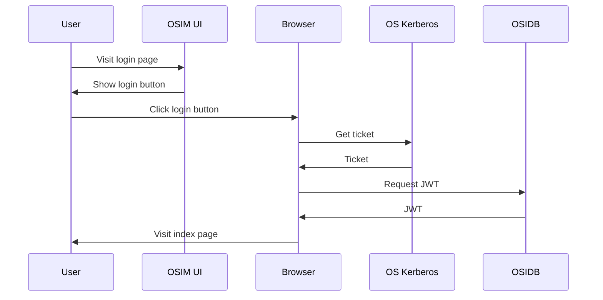
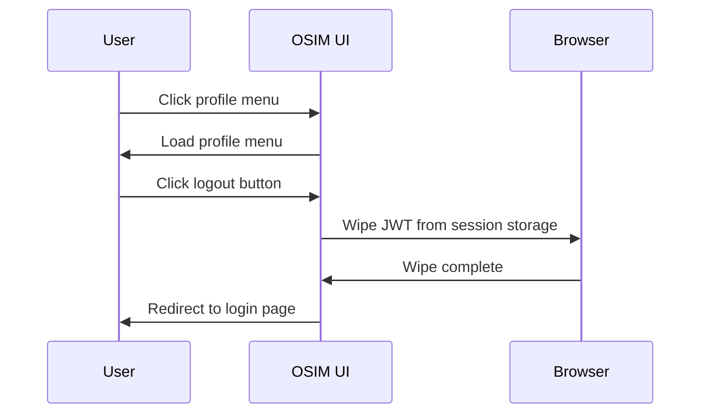
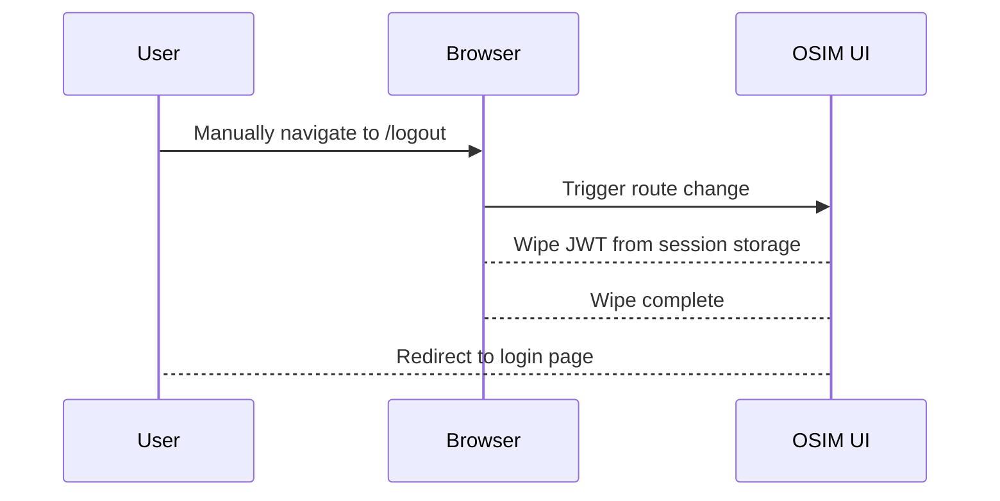
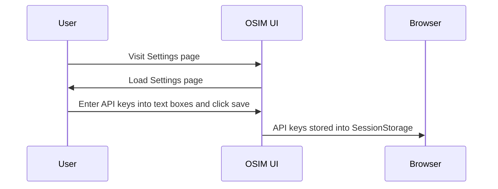
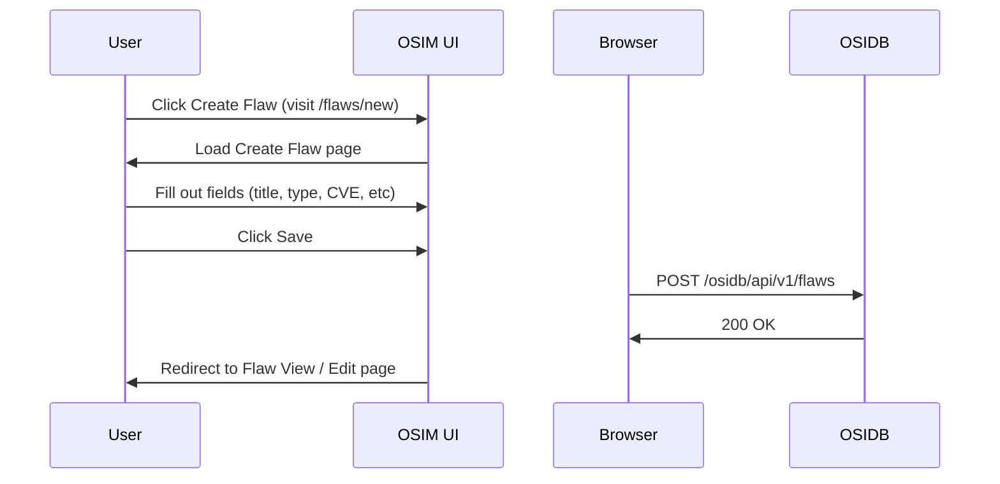
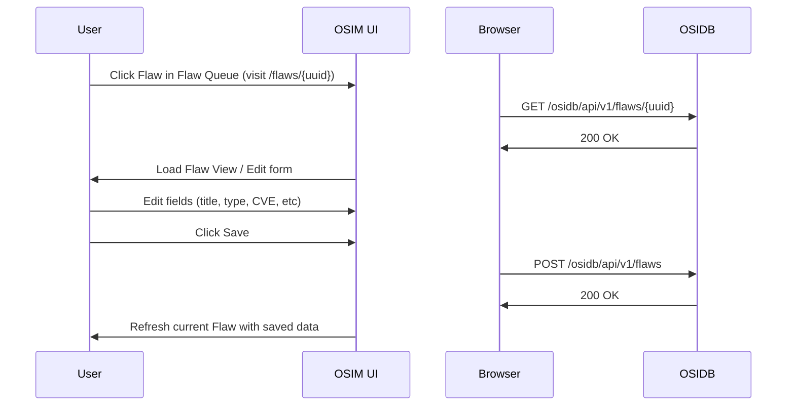
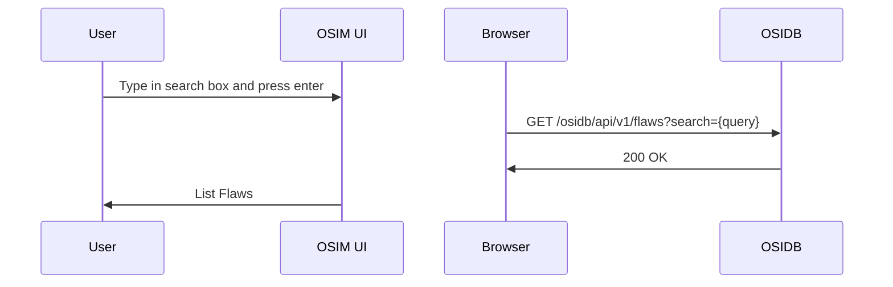

# PS Dev System Context

Alternate tools: https://c4model.com/#Tooling

```mermaid
C4Context
    title System Context diagram for Internet Banking System
    System_Ext(mitre, "Mitre.org")
    System_Ext(wan, "Interwebs...")
    System_Ext(assembler, "Assembler")
    Person_Ext(public, "public")
    SystemDb_Ext(fedoraComponentRegistry, "Fedora Component Registry")

    Boundary(internalBuildSystems, "Public Build Systems") {
        Container(koji, "Koji")
    }

    Enterprise_Boundary(b0, "Red Hat Internal") {
        Boundary(boundaryRedHatPeople, "People") {
            Person(irTeam, "IR Team")
            Person(securityArch, "Security Arch")
            Person(management, "Management")
            Person_Ext(engineer, "Engineer")
        }

        System_Ext(googleDocs, "Google Docs")
        System(customerPortal, "Customer Portal")
        System(betaSboms, "Beta SBOMs")
        System(signingServer, "Signing Server")
        SystemDb(roverLdap, "Rover LDAP")
        SystemDb(umb, "UMB")
        System(bugzilla, "Bugzilla")
        System_Ext(jira, "JIRA")
        System(errata, "Errata")
        System(cachito, "Cachito")
        System(pulp, "Pulp")
        System(pyxis, "Pyxis")

        Enterprise_Boundary(prodsec, "Product Security") {
            Boundary(boundaryApp, "App") {
                Container(sfm2, "SFM2")
                Container(dashboard, "Dashboard")
                Container(osimUi, "OSIM Web UI")
                Container(griffon, "Griffon")
            }
            Boundary(boundaryService, "Service") {
                Container(sdengine, "SDENGINE")
                Container(osimService, "OSIM Server")
                Container(openLcs, "OpenLCS")
                Container(deptopia, "Deptopia", "github repo")
            }
            Boundary(boundaryData, "Data") {
                Container(osidb, "OSIDB")
                ContainerQueue(prodDef, "Prod Def")
                Container(componentRegistry, "Component Registry")
            }
        }

        Boundary(internalBuildSystems, "Internal Build Systems") {
            Container(brew, "Brew")
            Container(pnc, "PNC")
            Container(rhtap, "RH-TAP")
        }

    }
    Rel(public, customerPortal, "Uses")
    Rel(customerPortal, betaSboms, "")
    Rel(prodDef, dashboard, "")
    Rel(prodDef, componentRegistry, "")
    Rel(prodDef, osidb, "")
    Rel(customerPortal, sdengine, "")
    Rel(betaSboms, sdengine, "")
    BiRel(osimUi, osimService, "")
    BiRel(griffon, osidb, "")
    BiRel(griffon, componentRegistry, "")
    Rel(deptopia, griffon, "")
    Rel(sdengine, errata, "")
    Rel(osidb, assembler, "")
    BiRel(osidb, bugzilla, "")
    BiRel(osidb, jira, "")
    BiRel(osidb, osimService, "")
    Rel(componentRegistry, errata, "")
    Rel(componentRegistry, cachito, "")
    Rel(componentRegistry, pulp, "")
    Rel(public, fedoraComponentRegistry, "")
    Rel(fedoraComponentRegistry, koji, "")
    Rel(brew, componentRegistry, "")
    Rel(pnc, componentRegistry, "")
    Rel(rhtap, componentRegistry, "")

```

## Login

```mermaid
sequenceDiagram
    User ->> OSIM UI: Visit login page
    OSIM UI ->> User: Show login button
    User ->> Browser: Click login button
    Browser ->> OS Kerberos: Get ticket
    OS Kerberos ->> Browser: Ticket
    Browser ->> OSIDB: Request JWT
    OSIDB ->> Browser: JWT
    Browser ->> User: Visit index page
```

## Logout (1)

```mermaid
sequenceDiagram
    User ->> OSIM UI: Click profile menu
    OSIM UI ->> User: Load profile menu
    User ->> OSIM UI: Click logout button
    OSIM UI ->> Browser: Wipe JWT from session storage
    Browser ->> OSIM UI: Wipe complete
    OSIM UI ->> User: Redirect to login page
```

## Logout (2)

```mermaid
sequenceDiagram
    User ->> Browser: Manually navigate to /logout
    Browser ->> OSIM UI: Trigger route change
    OSIM UI --> Browser: Wipe JWT from session storage
    Browser --> OSIM UI: Wipe complete
    OSIM UI --> User: Redirect to login page
```

## API Key Settings

```mermaid
sequenceDiagram
    User ->> OSIM UI: Visit Settings page
    OSIM UI ->> User: Load Settings page
    User ->> OSIM UI: Enter API keys into text boxes and click save
    OSIM UI ->> Browser: API keys stored into SessionStorage
```

## Flaw Create

```mermaid
sequenceDiagram
    User ->> OSIM UI: Click Create Flaw (visit /flaws/new)
    OSIM UI ->> User: Load Create Flaw page
    User ->> OSIM UI: Fill out fields (title, type, CVE, etc) 
    User ->> OSIM UI: Click Save 
    Browser ->> OSIDB: POST /osidb/api/v1/flaws
    OSIDB ->> Browser: 200 OK
    OSIM UI ->> User: Redirect to Flaw View / Edit page
```

## Flaw Edit

```mermaid
sequenceDiagram
    User ->> OSIM UI: Click Flaw in Flaw Queue (visit /flaws/{uuid})
    Browser ->> OSIDB: GET /osidb/api/v1/flaws/{uuid}
    OSIDB ->> Browser: 200 OK
    OSIM UI ->> User: Load Flaw View / Edit form
    User ->> OSIM UI: Edit fields (title, type, CVE, etc)
    User ->> OSIM UI: Click Save
    Browser ->> OSIDB: POST /osidb/api/v1/flaws
    OSIDB ->> Browser: 200 OK
    OSIM UI ->> User: Refresh current Flaw with saved data
```

## Search

```mermaid
sequenceDiagram
    User ->> OSIM UI: Type in search box and press enter
    Browser ->> OSIDB: GET /osidb/api/v1/flaws?search={query}
    OSIDB ->> Browser: 200 OK
    OSIM UI ->> User: List Flaws
```
